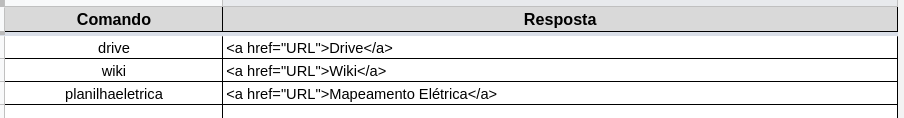

<h1 align="center" style="color:white; background-color:black">Tupão</h1>
<h2 align="center" style="color:white; background-color:black">Tupã Telegram-Spreadsheet Bot</h2>

<h4 align="center">A bot to interface google apps via telegram</h4>

<p align="center">
    <a href="https://tupa.eesc.usp.br//">
    
    </a>
    <a href="https://eesc.usp.br/">
    
    </a>
</p>
<p align="center">
    <a href="https://github.com/EESC-USP-TUPA/Telegram-Bot/issues">
    
    </a>
    <a href="https://github.com/EESC-USP-TUPA/Telegram-Bot/commits/main">
    
    </a>
    <a href="https://github.com/EESC-USP-TUPA/Telegram-Bot/graphs/contributors">
    
    </a>
    <br>
    <a href="https://github.com/EESC-USP-TUPA/Telegram-Bot/commits/main">
    
    </a>
    <a href="https://github.com/EESC-USP-TUPA/Telegram-Bot/issues">
    
    </a>
    <a href="https://github.com/EESC-USP-TUPA/Telegram-Bot/pulls">
    
    </a>
</p>

`Tupão` é um `Telegram bot` criado com o objetivo de fornecer assistência aos membros da extracurricular em
um cenário presencial, onde se faz necessário realizar atualizações em planilhas e serviços do `Google`, mesmo
sem possuir acesso direto a um computador.

O objetivo principal do `Tupão` é fornecer assistência durante o período de manufatura da equipe `EESC USP Tupã`.
 Para tal, o bot possui as seguintes funcionalidades básicas:

- `help`: Comando de ajuda, que fornece informação acerca de todos os comandos cadastrados
- `add`: Permite que sejam cadastradas novas tarefas na planilha de mapeamento da equipe
- `start/end`: Permite que seja atualizado o status de atividades cadastradas na planilha de mapemanto da equipe
- `list`: Lista todas as atividades cadastradas na planilha de mapeamentos da equipe
- `Extras`: Comandos de resposta simples registrados em uma planilha de comandos no `Google Sheets`


## Configuração

A configuração do `bot` é realizada através de um arquivo de variáveis de ambiente `.env`.

A formatação deste arquivo deve ser como apresentado abaixo:

```
TELEGRAM_BOT_TOKEN =
COMMANDS_SHEET_ID =
ELE_SHEET_ID =
MEC_SHEET_ID =
...
```

- `TELEGRAM_BOT_TOKEN` é o referente ao `token` para o bot, obtido através do `BotFather`.
- `COMMANDS_SHEET_ID` é o ID da planilha de comandos do bot
- `ELE_SHEET_ID` é o ID da planilha de mapeamento de tarefas do sistema da elétrica,
 e assim por diante para os demais sistemas.

Além disso, para que o bot possua permissão para manipular os arquivos do `Google`, é necessário
criar um usuáio no `DriveAPI` e baixar as configuraçãoes de `client_secret`, fornecidas em formato json.

As informações devem seguir o seguinte formato:

```
{
  "type": 
  "project_id": 
  "private_key_id": 
  "private_key":
  "client_email": 
  "client_id": 
  "auth_uri": 
  "token_uri": 
  "auth_provider_x509_cert_url": 
  "client_x509_cert_url": 
}
```

Para membros da equipe, a configuração utilizada atualmente pode ser encontrada
[neste link](https://drive.google.com/drive/folders/1xBYfFu1UMstL7kg57yETpns6aYJsKRio?ths=true).

## Dependências

O `bot` foi construído utilizando `Python 3.9.7` e conta com as dependências listadas no arquivo
`requirements.txt`. Para instalá-las, basta executar o comando `$ pip install requirements.txt`.

## Execução

Após configuradas as variáveis de ambiente, o bot pode ser executado através do arquivo `main`.
Basta utilizar o comando `$ python3 main.py`.

## Hosting

O bot é hospedado nos serviços do `Heroku` de modo a ficar online 24h.

